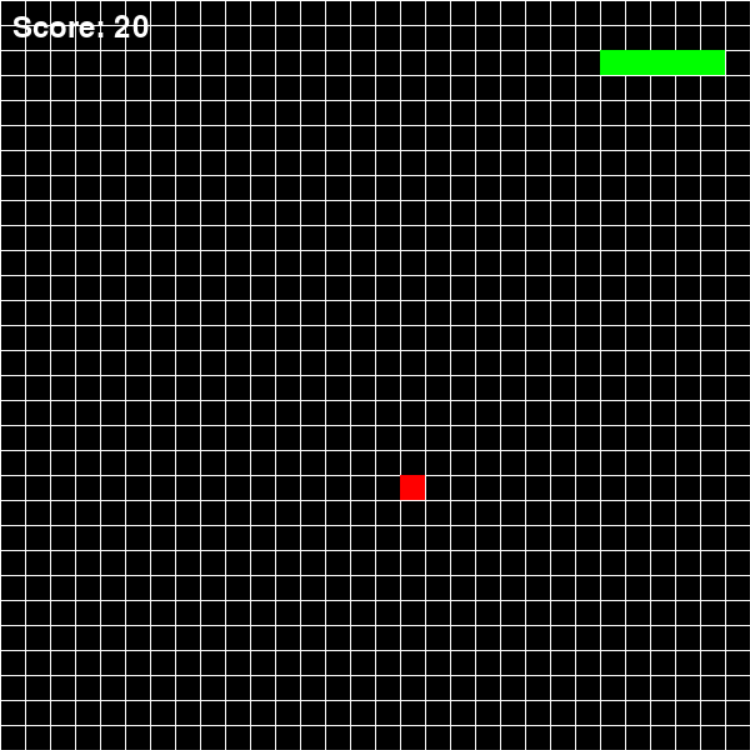
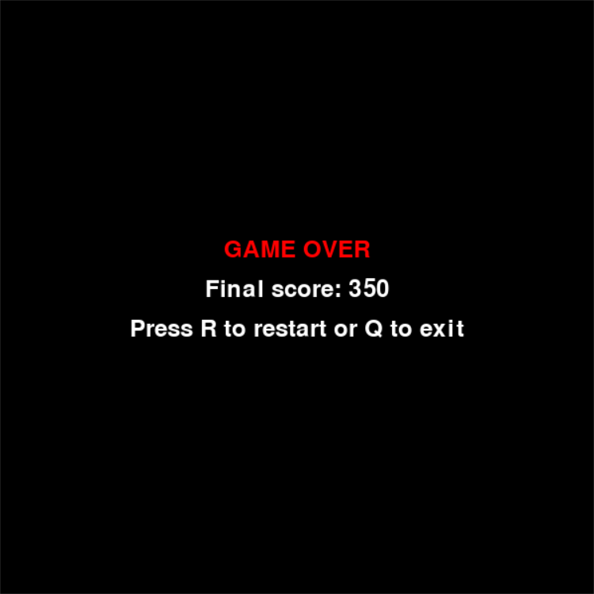

# 🐍 Snake Game

<div align="center">


*Classic Snake Game with a 30x30 grid*

[🎮 Play](#-quick-start) • [📖 Rules](#-game-rules) • [🎯 Control](#-control)

---

</div>

## 📸 Screenshots

<div align="center">
  
  
</div>

## ✨ Description

🐍 **Snake Game** - this is a modern interpretation of the classic Snake game, written in Python using the Pygame library. Enjoy a simple, but exciting gameplay with beautiful pixel graphics!

### 🎮 Features
- 🎯 **Simple control** - use the arrow keys
- 📏 **Customizable field** - 30x30 grid
- 🏃‍♂️ **Dynamic speed** - the game speeds up as the snake grows
- 🎨 **Classic graphics** - black and white pixel art
- 📊 **Score system** - each fruit gives 10 points

---

## 🚀 Quick start

### 📋 System requirements
- **Python**: 3.7 или выше
- **Pygame**: 2.0 или выше

### 🛠 Installation

1. **Clone the repository:**
   ```bash
   git clone https://github.com/Roosso/snake.git
   cd snake
   ```

2. **Install dependencies:**
   ```bash
   pip install -r requirements.txt
   ```
   Or install Pygame directly:
   ```bash
   pip install pygame>=2.0.0
   ```

3. **Run the game:**
   ```bash
   python snake.py
   ```

> 💡 **Tip**: Make sure you have the latest version of Python and Pygame installed

---

## 🎯 Game rules

🎮 **Goal of the game** - collect as many points as possible, controlling the snake and collecting red food.

### ⚠️ Rules:
- 🐍 **Control the snake** with the arrow keys
- 🍎 **Collect red food** to increase the score and length of the snake
- 💀 **The game ends**, when the snake collides with the walls or its own body
- 🎯 **Each eaten fruit** gives **10 points**

### 🏆 Gameplay:
1. The snake starts with 3 segments
2. When the food is eaten, the length increases
3. Speed gradually increases
4. The game continues until the snake collides with the walls or its own body

---

## 🎮 Control

| Key | Action |
|---------|----------|
| ⬆️ **↑** | Move up |
| ⬇️ **↓** | Move down |
| ⬅️ **←** | Move left |
| ➡️ **→** | Move right |

### 🎮 After the game ends:
- 🔄 **R** - start a new game
- 🚪 **Q** - exit the game

---

## ⚙️ Settings

The game supports the following settings:

```python
# Field sizes
WIDTH = 30   # width of the field in cells
HEIGHT = 30  # height of the field in cells

# Cell size
CELL_SIZE = 20  # size of one cell in pixels

# Initial length of the snake
INITIAL_LENGTH = 3
```

---

## 🏗 Technical details

### 🛠 Used technologies:
- **Python 3.7+**
- **Pygame 2.0+** - for graphics and input processing

### 📁 Project structure:
```
snake/
├── snake.py          # Main game file
├── requirements.txt  # Python dependencies
├── README.md         # Documentation
└── LICENSE          # MIT License
```

### 🎨 Color scheme:
- 🟫 **Black** (`#000000`) - background
- 🟩 **Green** (`#00FF00`) - snake
- 🟥 **Red** (`#FF0000`) - food
- 🟦 **Blue** (`#0000FF`) - accents

---

## 🤝 Contribution to the project

💡 **Have ideas for improvement?** We welcome contributions to the project!

### How to contribute:
1. 🍴 **Fork** the project
2. 🌿 **Create** a feature branch (`git checkout -b feature/amazing-feature`)
3. 💾 **Make a commit** of your changes (`git commit -m 'Add amazing feature'`)
4. 📤 **Push** the branch (`git push origin feature/amazing-feature`)
5. 🔍 **Create** a Pull Request

### 📝 Types of contribution:
- 🐛 **Bug fixes**
- ✨ **New features**
- 📚 **Documentation**
- 🎨 **UI/UX improvement**
- 🧪 **Tests**

---

## 📄 License

This project is distributed under the **MIT** license. See the [LICENSE](LICENSE) file for details.

```
MIT License

Copyright (c) 2025 alexandr Belov

Allowed to use, copy, modify, merge, publish, distribute, sublicense, and/or sell copies of the Software without restriction...
```

---

### 🙏 Thanks
- Thanks to the Python community for the excellent tools
- Inspiration from classic arcade games

---

<div align="center">

**Good luck! 🎉**

⭐ If you like the project, give it a star!

</div>
